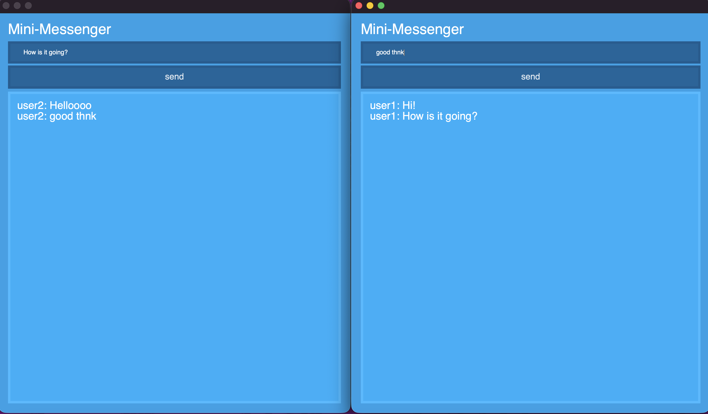
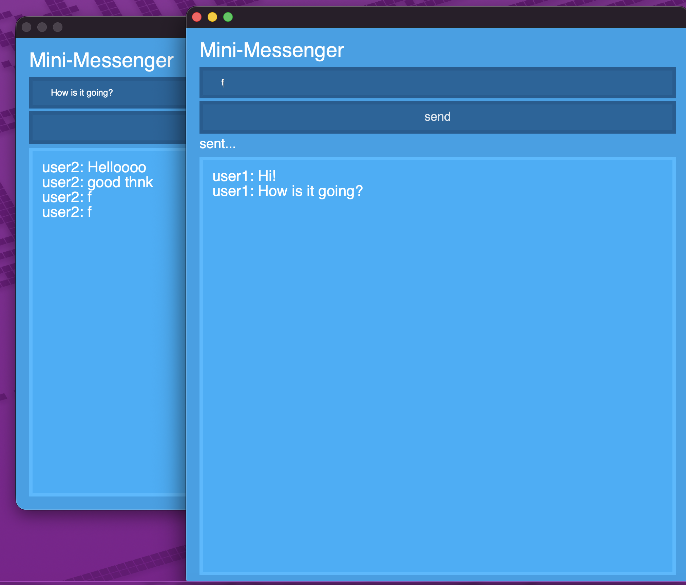
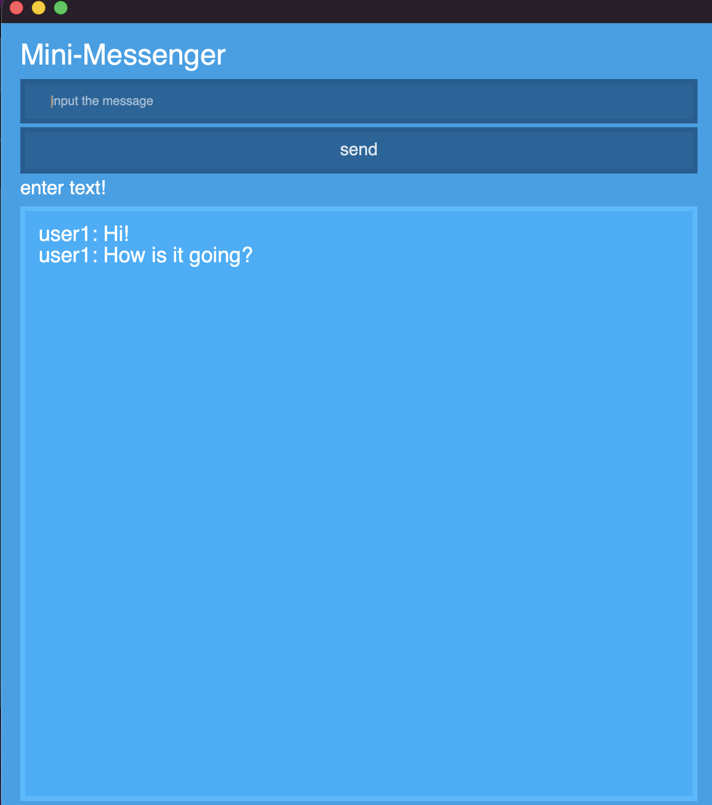

# 🔐 GUI Encrypted Messenger

## Проект представляет собой мини-мессенджер с шифрованием сообщений и удобным GUI интерфейсом.

Реализован real-time чат с использованием WebSockets и шифрованием сообщений через Fernet.

---

## 🚀 Возможности

- Обмен сообщениями в реальном времени  
- Шифрование сообщений (Fernet)  
- Простой GUI интерфейс (PyQt6)  
- Клиент-серверная архитектура  

---

## 🛠 Как запустить

### 1. Клонировать репозиторий
```bash
git https://github.com/germanzapisov/GUI-Encrypted-Messenger
```

###  2. Установить зависимости
```bash
pip install -r requirements.txt
```

###  3. Создать .env файл
```bash
FERNET_KEY=ваш_ключ
```

###  4. Запустить сервер
```bash
cd app
python server.py
```

###  5. Запустить клиент
```bash
cd app
python client.py
```

## Скриншоты 

___

___


